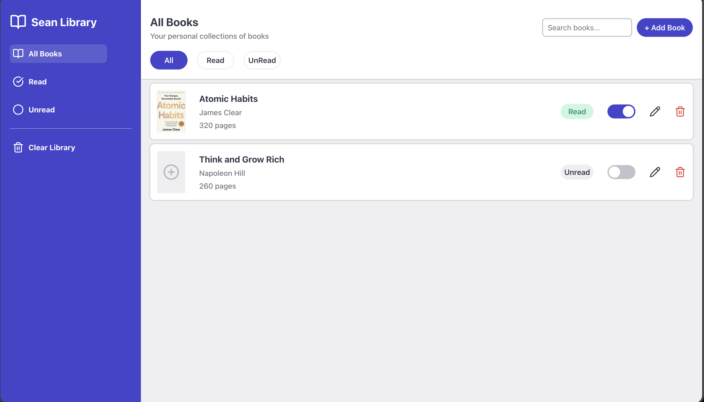

# 📚 Sean Library

A simple, web-based library application where users can curate their personal book collection. This project was built as part of [The Odin Project](https://www.theodinproject.com/) curriculum to learn about **Object Constructors** in JavaScript.




## Table of Contents
* [Features](#features)
* [Installation](#installation)
* [Usage](#usage)
* [To-Do](#to-do)
* [Preview](#preview)
* [Acknowledgments](#acknowledgments)
* [Credits](#credits)
* [License](#license)

## Features
* **Add New Books**: A modal form allows you to add books with title, author, page count, and read status.
* **Edit Books**: Click the edit icon on any book card to modify its details.
* **Delete Books**: Remove books from your library with the trash icon.
* **Toggle Read Status**: A switch on each book card lets you mark books as "Read" or "Unread" — the badge updates instantly.
* **Custom Book Covers**: Upload your own cover image for any book using the "+" icon on the book card.
* **Persistent Data**: Books are stored in memory using an array of objects, each with a unique ID generated via `crypto.randomUUID()`.
* **Responsive Design**: The library layout adapts to different screen sizes, with books displayed in a clean grid.
* **Interactive UI**: Smooth modal transitions, dropdown options, and visual feedback for actions.

## Installation
1. Clone the repository:
   ```bash
   git clone https://github.com/SrunTechsean/Library.git
   ```
2. Open `index.html` in any modern web browser.

## Usage
1. Click the **"+ Add Book"** button to open the modal form.
2. Fill in the book details (title, author, pages) and toggle the "Read" switch if you've finished it.
3. Click **"Add Book"** — your book will appear in the main log.
4. To edit a book, click the **pencil icon** on its card.
5. To delete a book, click the **trash icon**.
6. Toggle the **switch** on any card to mark it as read/unread.
7. To add a custom cover, click the **"+" icon** on the book card and select an image file.
8. Use the **"All" / "Read" / "Unread"** filter buttons at the top to sort your view.

## To-Do
* Add search functionality to filter books by title or author.
* Add a "Clear Library" option to remove all books at once.
* Improve accessibility with better ARIA labels and keyboard navigation.

## Preview
[Live Demo](https://sruntechsean.github.io/Library/)

## Acknowledgments
* This project was completed as part of [The Odin Project's](https://www.theodinproject.com/) JavaScript curriculum.
* Inspired by the "Library" project from TOP's Object Constructor lesson.

## Credits
* **Icons**: [Lucide](https://lucide.dev/) for clean, open-source SVG icons.
* **Switch Component**: Custom toggle switch styled with pure CSS.

## License
[MIT © SrunTechsean](LICENSE)
